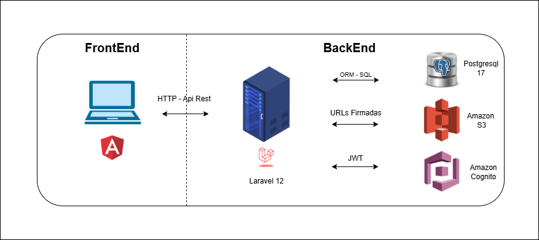

# Backend ServiceDesk

Servidor para ServiceDesk, desarrollado con Laravel 11 y conectada a base de datos PostgreSQL.

## Requisitos Previos

Tener instalado lo siguiente:

- [Docker Desktop](https://www.docker.com/products/docker-desktop)  
- DBeaver o PgAdmin para gestionar la base de datos.

## 1. Clonar el repositorio

## 2. Configurar archivo .env: Se configura la conexión a PostgreSQL y AWS

## 3. Levantar los contenedores con Docker con el comando `docker compose up -d --build`

## 4. Instalar dependencias y configurar Laravel:

`docker compose exec app bash`
Abre una terminal dentro del contenedor para ejecutar comandos directamente en el entorno.

`composer install`
Instala todas las dependencias PHP definidas en composer.json dentro del contenedor.

`php artisan key:generate`
Genera la clave de la aplicación Laravel (APP_KEY)

`php artisan migrate`
Ejecuta las migraciones para crear las tablas de la base de datos definidas en tu proyecto Laravel.

## 5. Acceder a la aplicación

- Levantar los contenedores (Laravel + PostgreSQL): `docker compose up -d` Esto inicia el backend y la base de datos en segundo plano. Se ejecuta `php artisan serve` automaticamnte desde el contenedor.

- Verificar que los contenedores estén corriendo: `docker ps`

- Acceder a Laravel en el navegador: Acceder a Laravel en el navegador: `http://localhost:8000`. 

- Opcional: ver logs del servidor para monitorear requests y errores: `docker compose logs -f app`

### Dependencias Utilizadas:

`aws-sdk SDK` oficial para PHP que permite trabajar con servicios como S3 y Cognito.

`firebase/php-jwt` Librería para decodificar y validar tokens JWT generados por AWS Cognito.

## Diagrama de Arquitectura

El siguiente diagrama muestra cómo se estructura la arquitectura del backend de Laravel.

